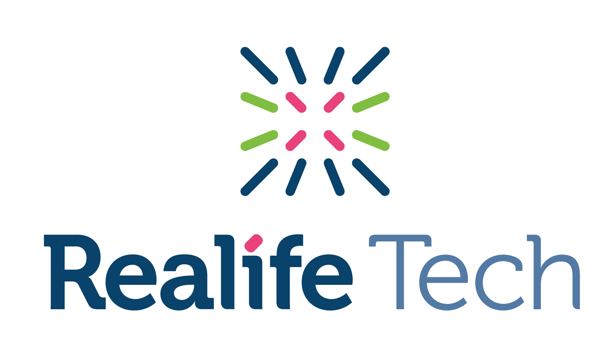

  

# iOS Playbook
In the spirit of one of LiveStyled's core behaviours, "Communicate openly", we present to you the iOS playbook, which aims to provide information about our iOS team and how it operates.

## Introduction
This team looks after the LiveStyled's iOS platform. We develop new features, test them, fix any issues, generate new client apps, and deploy them to the App Store.

## Glossary
- [The Team](#the-team) 👨‍👩‍
- [Interview Process](/interview) 🤔
- [Coding Standards](/etiquette/CODING_STANDARDS.md) 📝
- [Getting Started](/operations/gettingstarted/README.md) 🏃‍
- [Release Process](/operations/releaseprocess/README.md) 🌍

## The team
| Name  | Info |
| ------------- | ------------- |
| Ross Patman  | 󠁮󠁧🇬🇧󠁧󠁢󠁥󠁮󠁧󠁿 |
| Mickey Lee  | 🇹🇼 |
| Jonathon Albert | 🇬🇧󠁧󠁢󠁥󠁮󠁧󠁿 |
| Emal Saifi  | 🇫🇷 |
| iOS Developer  | On hire! |
