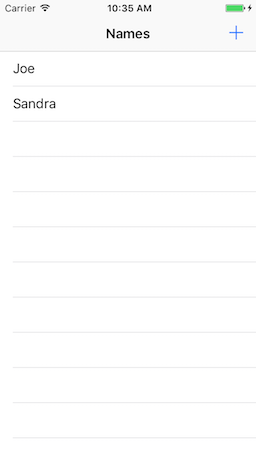

# Junior iOS Developer Technical Task
Please spend no longer than 2 hours completing the following task using no external dependencies, libraries or boilerplate code (start from Single View Application). If you are not able to finish within this time, please add comments explaining your next steps to complete the task.

Write a simple iPhone application in Swift, with two UIViewControllers contained within a UINavigationController. The first should contain a TableView, with each of its cells displaying just a name in a label. The names should be in ascending alphabetical order.
The second UIViewController should allow new names to be added to the list in the first via a horizontally centred text field and save button. The button should only be enabled if there is text within the text field.
The names should be stored in CoreData as an attribute of an entity named Person.

The application should look as follows:

 

For bonus points, only display in the table those names which have a capitalised first and last name, as follows:
'John Smith' = show
'john smith' = hide
For more bonus points, add unit tests.

When complete, please send us a link to a public git repository containing the project.
