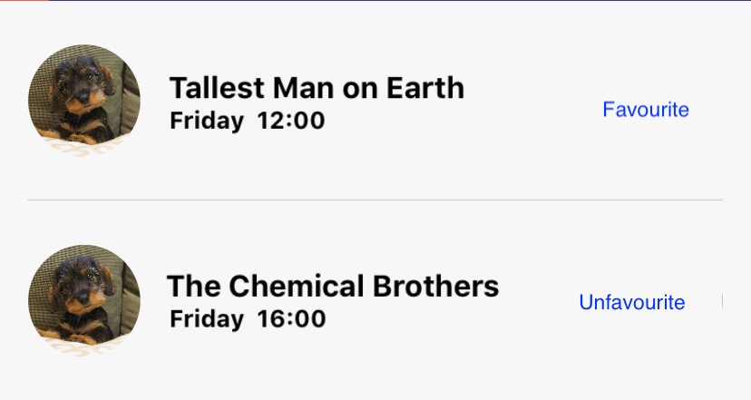

# iOS Developer Technical Task
Please spend no longer than half a day completing the following task. If you are not able to finish within this time, please add comments explaining your next steps to complete the task.

We would like you complete this task using a the tools, libraries, and patterns that you are most comfortable with, and that you would use for a project of your own.

Write a Swift application with one UIViewController containing a table view that shows events in ascending date order, with the next upcoming event at the top, and the furthest away at the bottom.
The event cells should display information about an event as follows:

Events should be fetched using the mock endpoint available at:
[https://my-json-server.typicode.com/livestyled/mock-api/events](https://my-json-server.typicode.com/livestyled/mock-api/events).  
_Note, this endpoint is paginated, and returns only 10 results at a time. To display the full list, you will either need to implement pagination by fetching the desired page using the \_page query parameter, or increase the limit on the response length using the limit query parameter. One of these will earn you more bonus points ;)_

We would also like you to allow the user to favourite/unfavourite events by tapping a button on the cell which indicates the current state. These actions should be persisted locally on the device.

Bonus points will be awarded for:
- Caching
- Dependency injection
- Tests

When complete, please send us a link to a public git repository containing the project.
