# Adding Testers

## Internal Testers/Users

### What is an internal tester?
An internal tester is a user that is usually part of the host accounts organisation, someone that will need to access any resources that iTunesConnect has. An internal tester/user will be someone that needs to make use of the iTunesConnect website in ways such as setting up the app store page, updating testers, filling in billing information or viewing analytics data.

### Who should be an internal tester?
Someone should be an internal tester if they require access to any and all builds that are submitted to the host account, **this can include builds that contain issues or may be broken** so think carefully about whether a particular user needs to receive every build. If not, they simply be added as an external tester which we will cover in the section at the bottom of this guide.

### How can I add someone as an internal tester
The process to add a user as an internal tester is as follows:

 1. After logging in, you will be presented with the following screen, **select 'users and access'**
 

     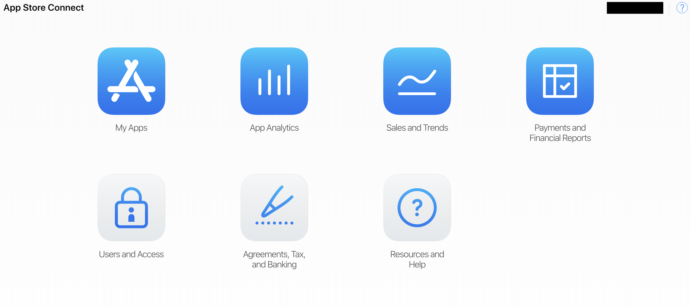
 

 2. You will now see a list of users who are currently internal testers within the host organisation.
 

     
 

3. **Select the blue '+' icon** and you will be presented with a dialogue box as similar to the one below
 

     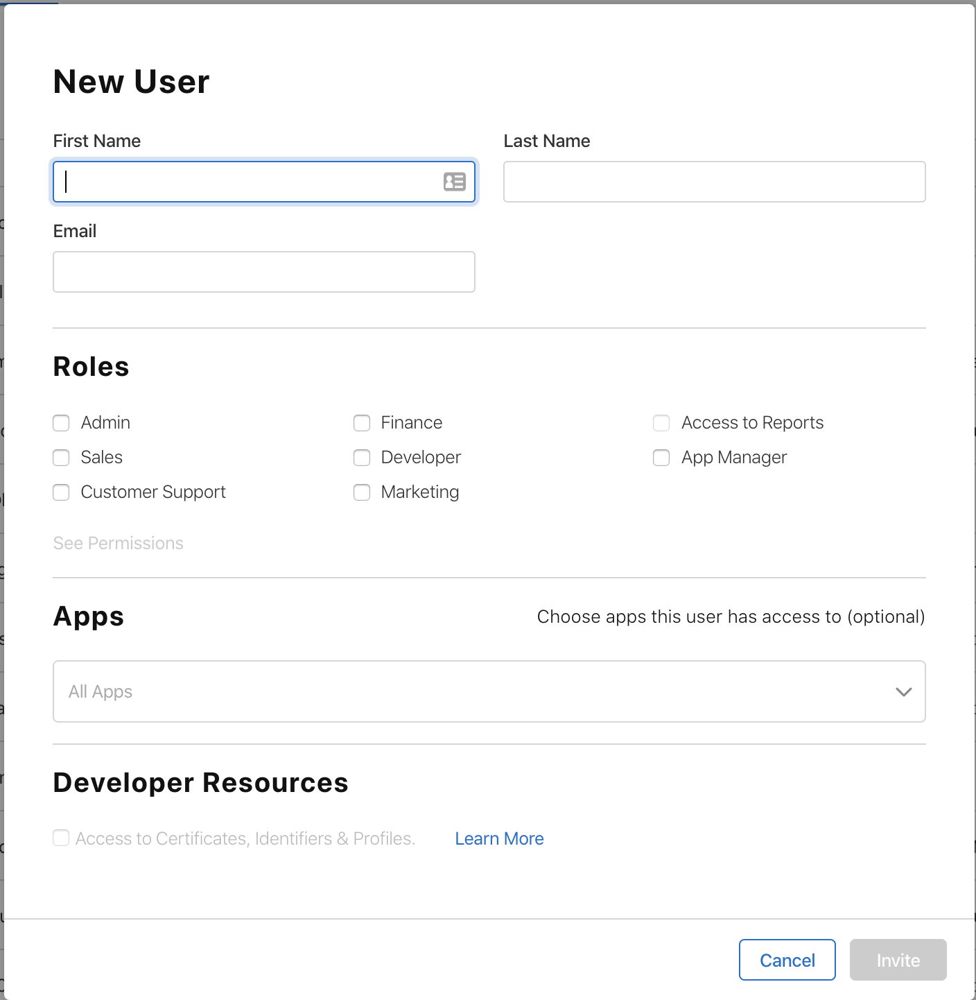
 

4. Fill in the information required and set a permissions level, depending on how much access you wish to give the user. Admin affords the greatest level of permissions and is capable of performing all tasks, if the new user is required to add and configure new and existing users then "App Manager" should be sufficient. If the user is being added only to receive internal builds and nothing else, then "Marketing" or "Customer Support" would be fine.

    

5. After **tapping the 'invite' button** you should be directed back to the list of internal testers with a new user added. The new user will receive an email inviting them to the account, **they must accept this** otherwise they will not be able to be added to apps as testers and subsequently not receive any builds of apps that are released.

6.  Back on the home screen and once the invited user has accepted their email request, **select 'My Apps'** and navigate into the app you are looking to add them to. **select 'testflight'** from the top bar and you should see the following screen.

    

7. **Select 'App Store Connect Users'** from the right hand menu, you will be presented with a list of users that you saw previously in the 'Users and Access' section but who have already been invited to receive builds.

    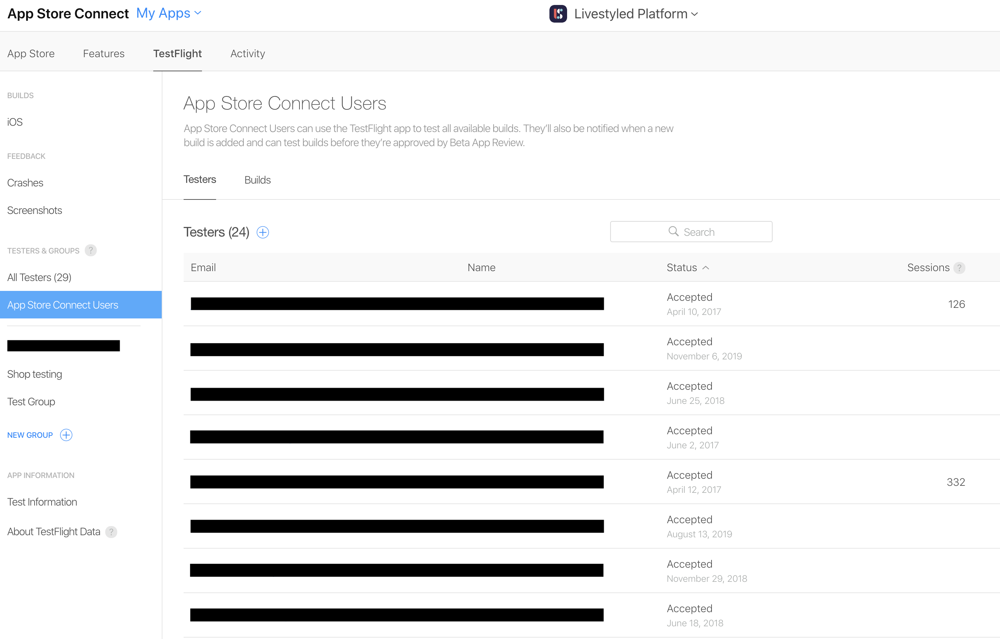

8. **Select the blue '+' icon** and you will see the following scrollable dialogue box, scroll through until you see the user that you want to add, **note - if they are not there, they haven't accepted the first email**. Once selected, **select the 'add' button**, a second email will be sent to the user and they will be invited to receive builds via testFlight (apple's test app distribution system, available on the appstore).

    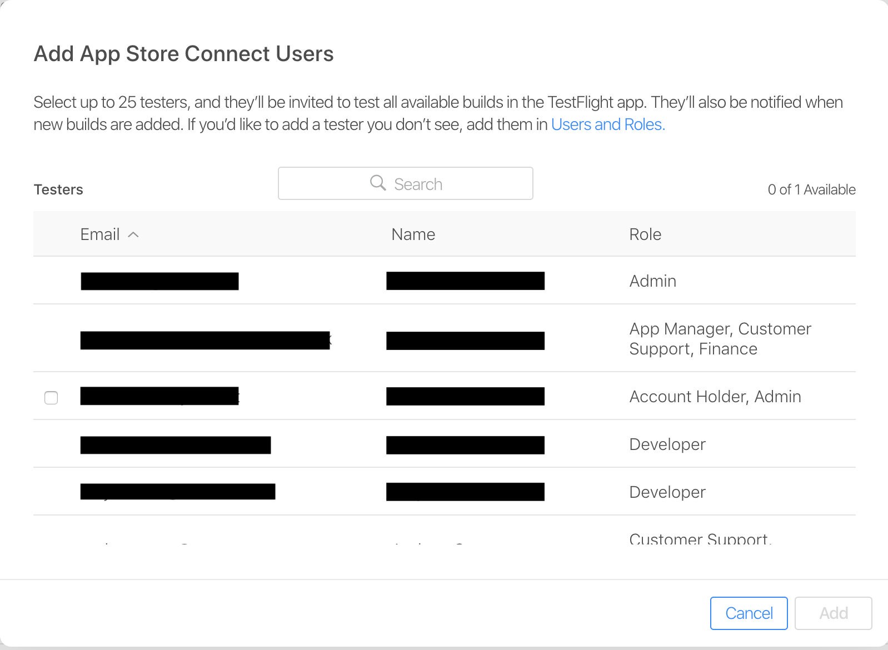

9. Once the user has downloaded the testFlight app and tapped the link in the email, they will then be able to access all existing and future builds of the app.

## External Testers

### **NOTE**
External testers are added to external builds of the app. An external build is a specific build that needs to be sent for 'beta approval', this is a miniature review that apple does to ensure the app is stable and safe for use by testers as any build distributed this way be sent to up to 10,000 users.

**Apple's beta review process can take between 24-48 hours** and will only be available to external testers if it successfully passes this process.

Another thing to mention is that only the first build of a version requires external review, subsequent builds of the same version will be automatically approved.

For example:
1. You submit version 11.1 build 11234 for external review.
2. After 24 hours, the build is approved and your testers are happy finding bugs and raising issues.
3. Your friendly neighbourhood developers lovingly resolve the issues and another build is uploaded to iTunesConnect, version 11.1 build 11235.
4. As they share the same version number, build 11235 can be submitted for external review again and is automatically be approved.

If there were substantial changes that required a version change, upping the version to 11.2 for example, this would then require the full external review process of 24-48 hours.

### What is an external tester?
An external tester is someone who will only want to receive select builds, either they do not need to see every build, or they are added to test at specific times, such as UAT (User Acceptance Testing) sessions or when requiring sign-off.

### Who should be an external tester?
Some testers may give too much feedback and not understand that many development builds contain known bugs. By adding them as an external tester, you can control which builds they are asked to test, ensuring they only see curated builds that are in a better position to be demo'ed.

### How can I add someone as an external tester
The process to add a user as an external tester is similar to the above.

1. Starting at the home page, **select 'My Apps'**.

    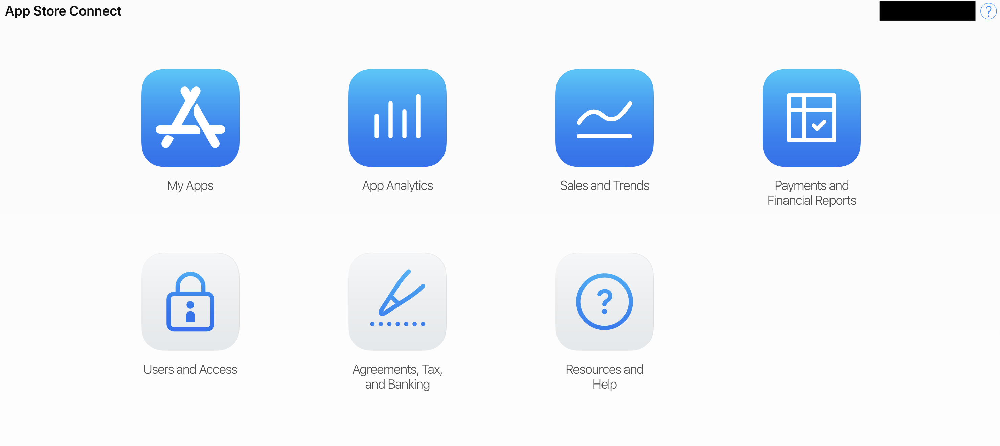

2. Navigate in to the app you wish to add testers to, **select 'testflight' from the top bar** and you will be presented with the following page

    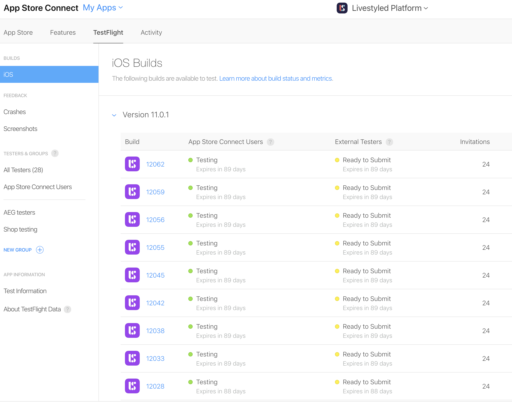

3. **Select 'New Group'** from the left side menu, entering a group name in the dialogue box that appears, the group will be where you can put different users. Different groups can be added to the same or different builds.

    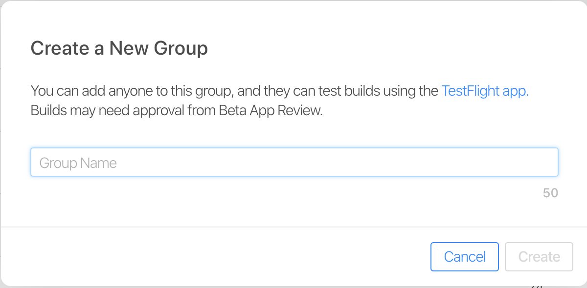

4. A new group should appear in the left menu, after tapping in to it, next to the empty list of testers, **select the blue '+' button**. You are presented with three options, "Add new testers", "Add existing testers", and "import from CSV", this guide will cover the first option "Add new testers", if you want more information about the others, book in some time with a developer from the iOS team and they will be happy to help.

    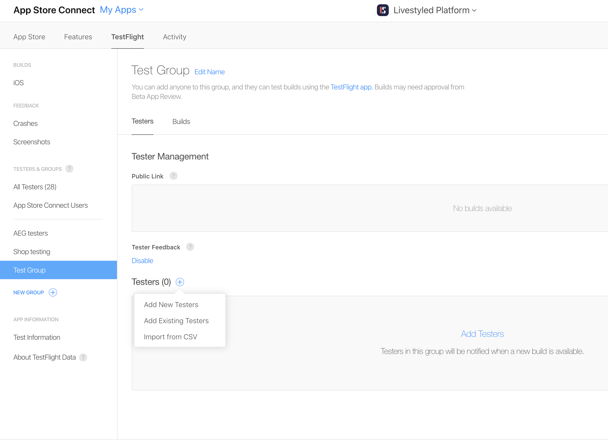

5. A dialogue box will pop up asking you to add an email, first name and last name, only the email is required but it helps to add as much information as you have, especially when strange email addresses are concerned.

    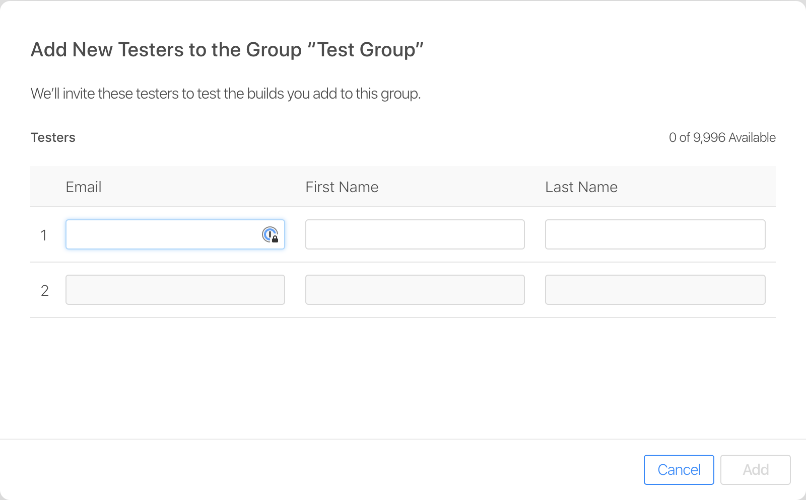

    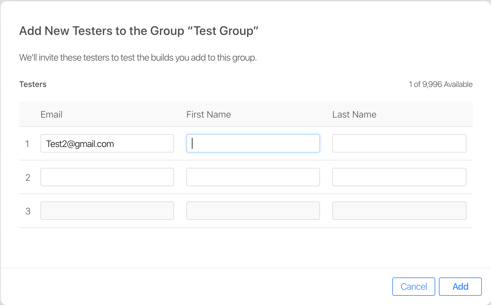

6. Once you have finished adding users to the invite list, **select 'add'** and you will be directed back to the previous screen with your newly added users in a list.

    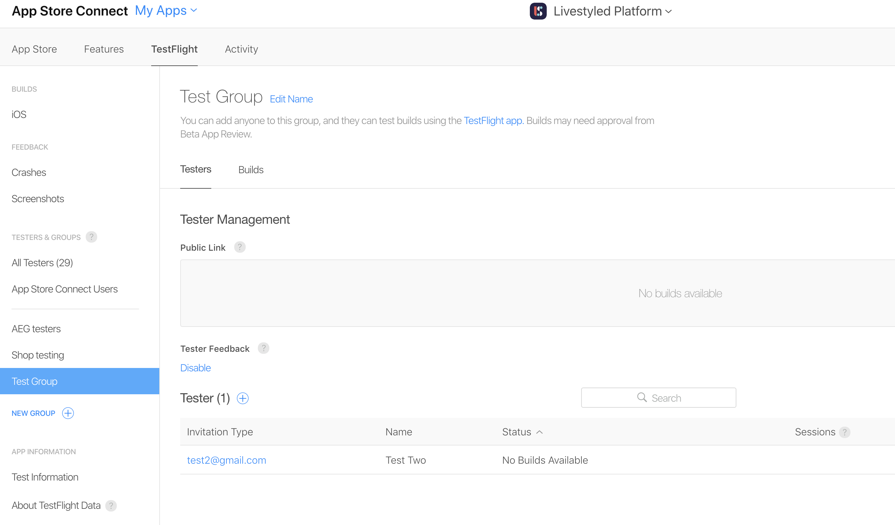

7. Now you need some builds to add the group to. From the same screen **select 'builds'**. This screen shows the list of eligible builds that are available to external testers, in most cases the list will be empty as shown below.

    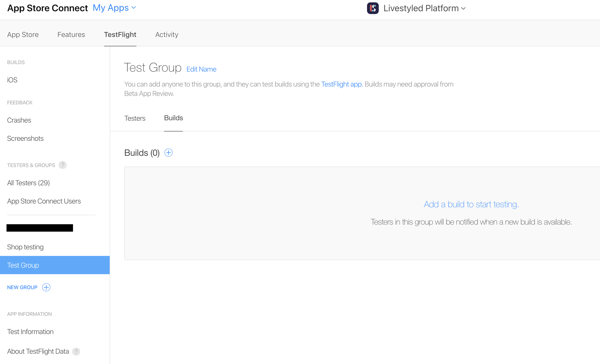

8. **Select the blue '+' button**, this will open a dialogue to select a build that allows you to select a build, sorted by version and build number, to submit for external review.

    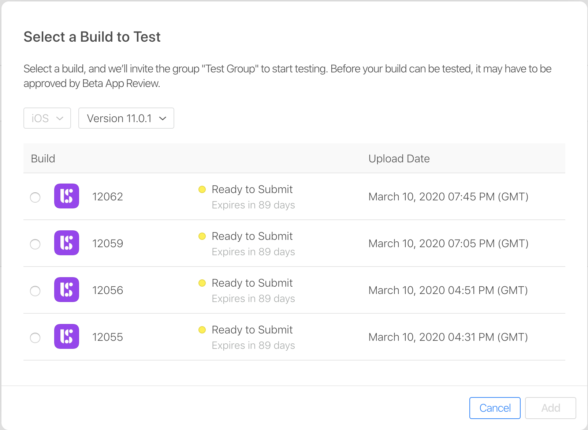

9. **Select a build**, after continuing, you will be asked to provide test credentials if they are required.

    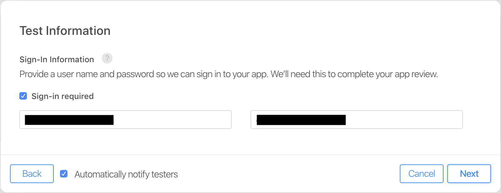

10. The next step involves adding some testing information, this can range from a few words to full paragraphs about what you want the users to look out for or test in this particular version.

    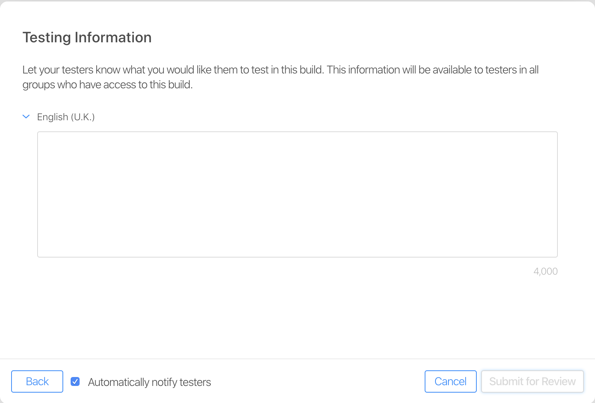

    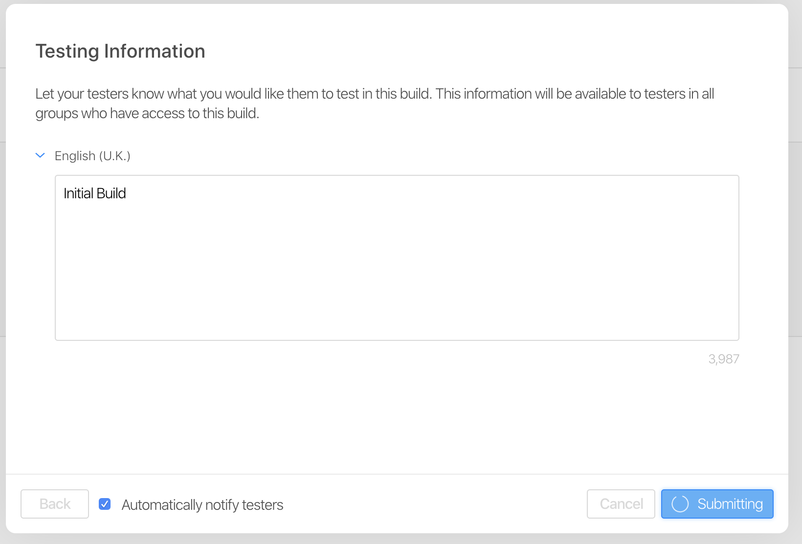

11. After continuing from the test information dialogue, you will be redirected back to your list of builds where the selected build is now queued for review. testFlight notifications will be emailed to users within the added group once it has been approved for external testing.

    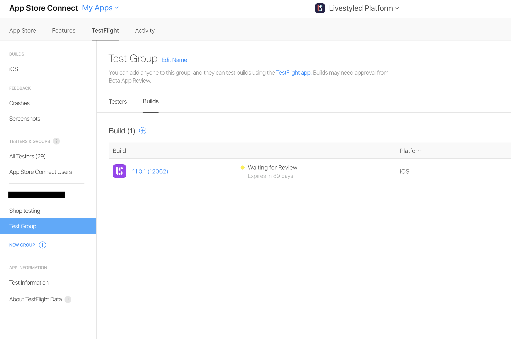

