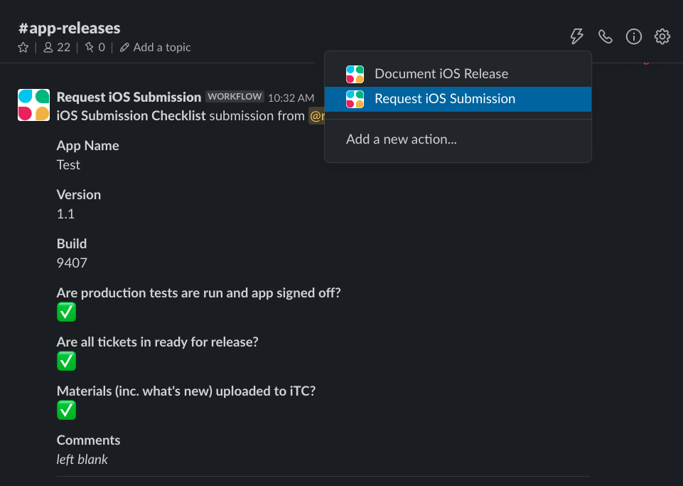
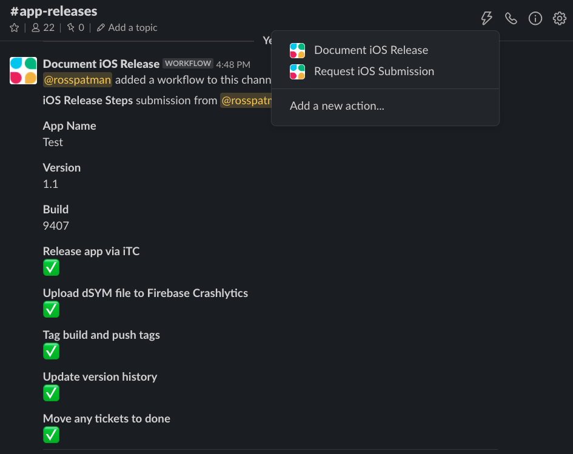

# Release process

## Buddybuild/BitBucket integration
Whenever a build is pushed to the BitBucket repository, buddybuild will lint it, build it, and run the tests.

For the branches listed below, buddybuild will also deploy the app to iTunes Connect.

### Platform builds:
`master`, `develop`, `release/*`, `feature/*`

### App builds:
Individual `app/XXX` branches are manually configured, as they deploy to dedicated iTunes Connect accounts.

## Buddybuild deployment configuration
If you would like to deploy a branch to buddybuild, you must:
1. Create a build override within app settings > build configurations, turning build for archive on
2. Create a test override within app settings > test settings, turning only run tests off
3. Set up code signing within app settings > code signing
4. Create a deployment within deployments

## Submission materials
Replace text in **bold** with corresponding values.  

### Sign-in information
Valid sign-in credentials should be provided for the corresponding environment if the app has sign-in functionality. 

### Apple Music (note, you should test that the deeplink/Apple Music playlist is enabled): 
Through the app, users may in the future have the ability to listen to Apple Music playlists natively within the app. This feature would be accessible via deep-link from a button on the menu. We have chosen to not enable this button for submission as it will be enabled at a later date. For testing purposes, you can access a playlist via the following deep-link: **ReplaceWithAppDeepLinkScheme**://applemusic/pl.u-oZylD6gsGbX9XV6  

### Colocator (only if Colocator is enabled):
-How does your app utilize background bluetooth-central, bluetooth-peripheral functionalities?  
These methods are referenced by the Crowd Connected Colocator iOS SDK framework, which is embedded in the app. However, due to the manner in which the App uses the Crowd Connected Colocator iOS SDK, these methods are never actually called.  

-Does this app detect startMonitoringForRegion:, startRangingBeaconsInRegion:, or both?  
Both methods are used by the embedded Crowd Connected Colocator iOS SDK framework to more accurately determine the user's current location both indoors and out, minimising the dependency on GPS. These methods are not used continually. Actual calls to these methods are determined dynamically by the Crowd Connected Colocator system so they are only used in environments where they will be beneficial.

-What is the user experience when the app detects the presence of a beacon?  
The Crowd Connected Colocator iOS SDK uses the presence of beacons to provide accurate location information. This information allows the app to target highly relevant push notifications, including emergency and safety messaging relevant to the venue/event.  

-What features in this app use background location?  
Background location is used to accurately determine the user's current position. This information allows the app to target highly relevant push notifications, including emergency and safety messaging relevant to the venue/event.  

-If this app uses 3rd party SDKs for iBeacons, please provide links to their documentation showing that background location is required for it to function.
You can find the Crowd Connected Colocator iOS SDK and its indoor positioning feature documentation at https://developers.colocator.net/sdk/ios

## Requests for submission
Requests to submit an app for Apple review must come via the **Request iOS Submission** workflow in the **app-releases** Slack channel:  

    

## Releasing to the :earth_africa:
Requests to release an app that have been approved by Apple should come via the **app-releases** Slack channel.  
We should respond to them using the **Document iOS Release** workflow, checking off the items as we complete them. Details on each item can be found below.  

    

**Release app via iTC:** press the button!  
**Upload dSYM file to Firebase Crashlytics:** download the dSYMs file from buddybuild, unzip, find the .dSYM file that corresponds to the app (e.g. LiveStyled.app.dSYM), zip it, and upload it Firebase->Quality->Crashlytics (for the corresponding project)  
**Tag build and push tags:** `git tag BranchName/X.X / git push --tags`  
**Update version history:** update the date and colour for the app [here](https://livestyled.atlassian.net/wiki/spaces/1LP/pages/103251969/iOS+Platform+Version+History)  
**Move any tickets to done:** move JIRA tickets to done and unassign  

## Timings:
**Buddybuild:** ~25 minutes  
**iTunes Connect processing:** ~30 minutes  
**App store review time:** ~1 day  
**App store expedited review time:** Usually <1 day to enter review  